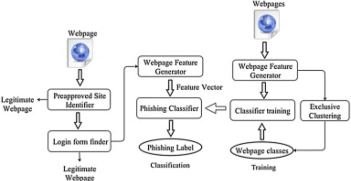
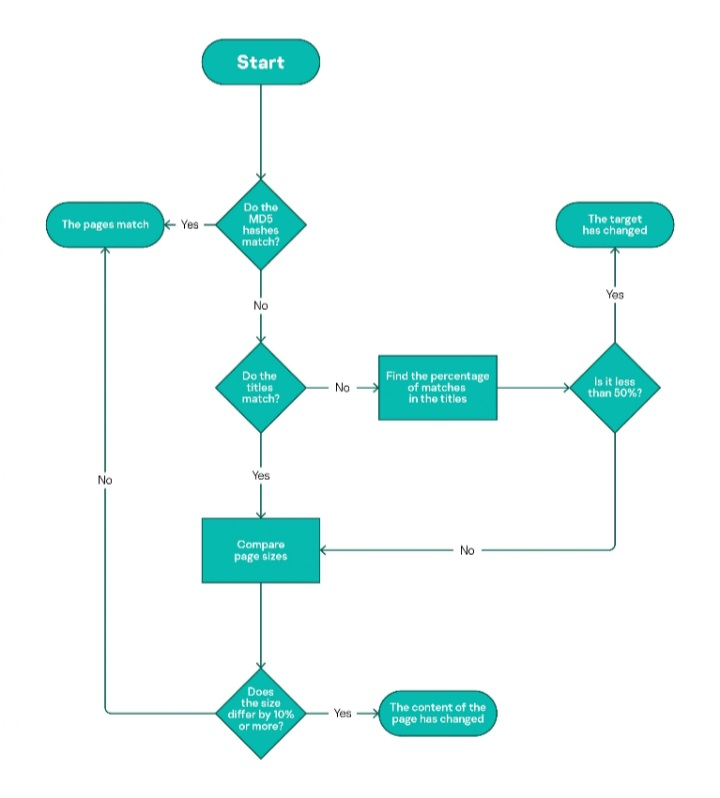

<p align="center">
  
</p>

<p align="center">
  
</p>

<h1 align="center">🔐 Phishing Detection Toolkit</h1>

<p align="center">
A complete <b>ethical hacking & cybersecurity project</b> that detects phishing attempts
using content analysis, similarity detection, and machine learning.
</p>

<p align="center">
  
  
  
  
  
  
</p>

---

## 🚀 Project Overview

Phishing is one of the most common and dangerous cybersecurity threats, where attackers
impersonate legitimate websites or emails to steal sensitive information.

This project implements a **defensive phishing detection system** that analyzes:
- Webpage structure and content
- Similarity with known legitimate pages
- Page change behavior
- Extracted features processed using Machine Learning

The system classifies inputs as **Legitimate** or **Phishing** and provides
clear security insights.

---

## 🧠 Machine Learning Lifecycle

<p align="center">
  
</p>

The ML pipeline follows a complete lifecycle:
1. Data collection and preprocessing  
2. Feature extraction  
3. Model definition and training  
4. Evaluation and improvement  
5. Deployment for real-time prediction  

This ensures accuracy, scalability, and continuous improvement.

---

## 🏗️ System Architecture

<p align="center">
  
</p>

### Architecture Flow
1. A webpage or email is given as input  
2. Features are extracted from content, metadata, and structure  
3. The trained classifier evaluates these features  
4. The system outputs **Phishing** or **Legitimate**  

The architecture is modular and extensible for future enhancements.

---

## 🔁 Content Change & Similarity Detection Logic

<p align="center">
  
</p>

Phishing pages often copy real websites with small changes.
To detect this behavior, the system compares:

- MD5 content hashes  
- Page titles  
- Text similarity percentage  
- Page size difference  

Significant deviation indicates potential phishing activity.

---

## 📊 Security Dashboard Preview

<p align="center">
  
</p>

The dashboard provides:
- Vulnerability overview  
- Entry point breakdown  
- Severity distribution  
- Ongoing scan statistics  

This gives a centralized view of security analysis results.

---

## 🎥 Animated Demo (Execution Proof)

### CLI Phishing Scanner
<p align="center">
  
</p>

### Web Interface Scanner
<p align="center">
  
</p>

> These animations demonstrate real-time phishing detection in action.

---

## 🛠️ Tech Stack

| Layer | Technology |
|-----|-----------|
| Language | Python |
| ML | Scikit-learn |
| Backend | Flask |
| Detection Logic | Hashing, similarity analysis |
| DevOps | Docker, GitHub Actions |
| UI | HTML, CSS |

---

## 📂 Project Structure

```bash
phishing-detection-toolkit/
│── app.py
│── email_analyzer.py
│── report_generator.py
│── logging_app.py
│── requirements.txt
│── Dockerfile
│── docker-compose.yml
│── README.md
│
├── assets/
│   ├── ml-lifecycle.png
│   ├── content-change-flow.png
│   ├── phishing-detection-architecture.png
│   ├── security-dashboard.png
│   ├── cli-demo.gif
│   └── web-ui-demo.gif
│
└── .github/workflows/
    └── python-ci.yml

## ▶️ How to Run Locally

Follow these steps to run the phishing detection toolkit on your local machine.

### 1. Clone the repository
```bash
git clone https://github.com/vengababu-X/phishing-detection-toolkit.git
cd phishing-detection-toolkit

## Install dependencies
pip install -r requirements.txt

## Run the application
python app.py

## Access the application
   Open your browser and go to:
http://127.0.0.1:5000

### Example Scenario

- Original website title: `Secure Login - Bank`
- Current page title: `Verify Your Account Now`
- Content hash mismatch
- Page size differs by more than 10%

➡️ Result: **Do Not Match → Page flagged as suspicious**
